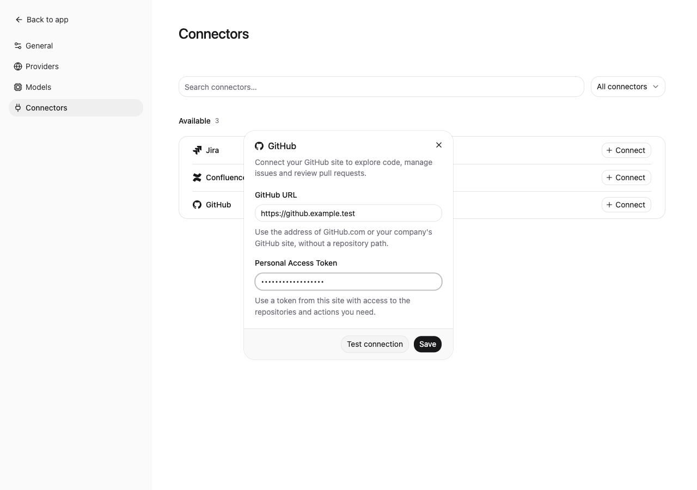

# GitHub integration

WorkLens connects to **one user-configured GitHub site and account**, with access to multiple organizations and repositories on that site. The URL starts **empty**. No GitHub host, organization or username convention is preconfigured.

The connector uses the pinned **Octokit JavaScript SDK** for REST and GraphQL. Users do not need `gh` or Git installed for remote operations. Local cloning, checkout and builds remain separate local-tool workflows.

This implements the daily contributor/maintainer categories in [issue #3](https://github.com/BuildWithAIs/worklens/issues/3). The agreed single-connection design supersedes the issue's original multiple-connection requirement. Write interaction follows the existing Jira/Confluence connectors: concrete user instructions can authorize writes directly; no per-operation approval dialogs or model-generated `confirmed` flags are introduced. This connector does not implement a separate execution-time user-consent authority. Repository permissions and branch policies are enforced by GitHub; these are not substitutes for user consent.

## Setup

Open **Settings → Connectors → Connect GitHub**, enter the **site root URL** and a Personal Access Token from that site. Use the address shown before the organization/repository path. Testing is optional; saving always verifies the authenticated identity. The settings dialog shows the login and server version when supplied by the server.



| Site entered by user         | REST address                        | GraphQL address                          |
| ---------------------------- | ----------------------------------- | ---------------------------------------- |
| `https://github.com`         | `https://api.github.com`            | `https://api.github.com/graphql`         |
| `https://TENANT.ghe.com`     | `https://api.TENANT.ghe.com`        | `https://api.TENANT.ghe.com/graphql`     |
| `https://github.example.com` | `https://github.example.com/api/v3` | `https://github.example.com/api/graphql` |

GitHub.com and GHE.com require HTTPS. Explicit HTTP URLs remain possible for intranet Enterprise Server deployments, matching existing connector behavior. URLs containing credentials, query strings, fragments, repository paths or API paths are rejected. Custom reverse proxies exposing GitHub beneath a URL subpath are not supported. Certificate verification is not disabled.

Credentials are encrypted using Electron safeStorage in `github.json`, with no plaintext fallback. Bootstrap/renderer data includes only connection metadata. Blank token input retains the saved token only for the same normalized site. Changing the site requires a new token. Saving invalid credentials disables tools and retains encrypted settings for correction. Startup revalidates saved credentials. Changing/removing a connection cancels old requests and invalidates old continuations and previews. Disconnect preserves conversations and downloaded artifacts.

### Authentication and permissions

Personal access tokens are passed to Octokit in the main process. Classic and fine-grained PATs can be used where the selected deployment and endpoint support them. OAuth login, GitHub App installation auth and browser/SSO session cookies are not included.

Grant access for the work needed, rather than treating a successful identity check as proof of full access:

| Work                                             | Relevant permission areas                                                                   |
| ------------------------------------------------ | ------------------------------------------------------------------------------------------- |
| Repository/code and remote commits               | Selected repositories; Contents read/write                                                  |
| Issues and triage                                | Issues read/write                                                                           |
| PRs and reviews                                  | Pull requests read/write; repository access                                                 |
| CI logs, reruns, dispatch and artifacts          | Actions read/write; workflow/ref access                                                     |
| Releases and assets                              | Repository Contents permissions                                                             |
| Projects, Discussions and organization discovery | Corresponding project/discussion/organization permissions supported by token and deployment |
| Notifications and subscriptions                  | Personal notification/subscription access supported by the token                            |

Classic PAT scopes such as `repo`, `read:org`, `project`, `read:discussion`, `write:discussion`, `notifications`, and `workflow` apply according to the requested operation. Fine-grained PATs have different permission rules and feature limitations; some operations may require a classic PAT or may be disallowed by the organization. SSO authorization and organization approval may also be required. Errors preserve the distinction between authentication, permission, conflict and unavailable/hidden targets. A 404 does not prove that a server lacks a feature.

See [GitHub PAT documentation](https://docs.github.com/en/authentication/keeping-your-account-and-data-secure/managing-your-personal-access-tokens) and [Octokit Enterprise configuration](https://github.com/octokit/octokit.js#constructor-options).

## Tools and supported work

Two Agent tools are registered: `github_read` and `github_write`. Initial schemas expose the operation names; exact schemas are discovered on demand:

```json
{ "request": { "operation": "describe_operation", "name": "create_issue" } }
```

```json
{
  "request": {
    "operation": "create_issue",
    "repo": "owner/repository",
    "title": "Investigate login failure",
    "body": "Observed behavior and reproduction steps",
    "labels": ["bug"]
  }
}
```

`repo` accepts `owner/repository` or a repository URL on the configured site. Issue/PR numbers are always paired with that repository. Unknown arguments, token/host overrides, arbitrary REST endpoints and GraphQL documents are rejected. Project owners and numbers resolve to real node IDs internally; project fields and select options can be identified by discovered unique names or IDs.

The [full operation catalog](github-operations.md) contains **98 read/preparation operations and 99 write operations**.

| Area              | Implemented workflows                                                                                                                                                                              |
| ----------------- | -------------------------------------------------------------------------------------------------------------------------------------------------------------------------------------------------- |
| Discovery         | Identity, server metadata, rate limits, repositories, organizations, teams, users, collaborators, labels, milestones and issue types                                                               |
| Code/repositories | Native repository/code/issue/PR/commit/user search; README, files, trees, blobs, branches, tags, commits and comparisons; fork, branch and tag management; atomic multi-file commits               |
| Issues            | Create/update/close/reopen, comments, labels, assignees, milestones, types, timeline, parent/sub-issues, dependencies, reactions, lock/unlock, pin/unpin, transfer, delete and bounded bulk triage |
| PRs/reviews       | PR creation/editing, draft/ready, reviewers, commits/files, reviews and inline comments, replies, resolve/unresolve, pending review lifecycle, branch update, merge, auto-merge and merge queues   |
| Actions           | Workflows, runs, attempts/jobs, check runs/suites/annotations, statuses, logs, dispatch/rerun/cancel, artifact download/deletion, deployment and environment status                                |
| Releases          | Release metadata/assets, generated notes, draft creation/editing/publication, deletion and asset upload/download/deletion; Git tags are separate operations                                        |
| Projects          | Discovery, views, fields/options/iterations, items and values; add/remove/archive/unarchive, field updates/clears, draft creation/editing/conversion                                               |
| Discussions       | Categories, listing/search/reading, comments/replies, create/edit/delete, reactions and answer marking                                                                                             |
| Personal work     | Notifications, mark read/done, thread/repository subscriptions and stars; compose assigned-issue/authored-PR/review-request searches for a personal inbox                                          |

Operations unavailable in an older Enterprise version or disabled for the account return remote errors. GraphQL missing-field/type errors are explicitly classified as unsupported capabilities. The catalog describes implementation, not universal server availability.

## Execution and recovery

- Reads and writes each have a serial queue across sessions. Waiting requests respond to cancellation without waiting for an unrelated request to finish. Requests carry connection, run and session identity.
- REST uses API version `2022-11-28`. Octokit's automatic retries/throttling are disabled so write retries are not hidden inside the SDK. Safe reads retry transient failures at most twice, respecting rate-limit/reset guidance; long requested waits return `rate_limit`.
- GraphQL queries are read operations even though they use POST. Mutations are explicitly classified. GraphQL partial errors remain errors with partial data, never unconditional success.
- Writes are journaled before dispatch. Retries of the same tool invocation ID in the same run replay their result; a new invocation executes even when its parameters match an earlier write. Reusing an invocation ID with different parameters is rejected. Network failure after dispatch produces `unknown`; `read_operation` retrieves the journal. Read the remote target before deciding whether another write is appropriate. This is local duplicate suppression, not exactly-once remote delivery.
- Composite steps preserve successful outcomes. `preview_batch` captures at most 50 explicit issues and their update times; `batch` checks them again, reports per-item results and does not roll back completed items. Prepare a new batch only for known failed items. Unknown items require remote reconciliation first.
- Reviews validate the expected PR head, actual file patches, side and line ranges. Missing/truncated patches cannot authorize guessed anchors. Pending reviews must belong to the current commit. Merge sends the expected SHA and uses allowed repository merge methods, without admin bypass or automatic branch deletion.
- `commit_files` uses GraphQL `createCommitOnBranch` with `expectedHeadOid`, so multiple file additions/deletions form one atomic commit. Duplicate paths and stale heads are rejected. Enterprise installations lacking this mutation report the limitation; the connector does not replace it with non-atomic sequential file writes.
- Release creation defaults to a draft and requires an existing tag. Tag creation/deletion is explicit. Asset name collisions fail; replacement requires a separate explicit deletion. Ref deletion checks current SHA and branch protection, but GitHub's deletion endpoint does not provide an atomic SHA condition, so a remote concurrency window remains.
- Workflow dispatch validates the selected ref and the workflow's YAML inputs, including required/choice/boolean/number/environment inputs. Dispatch, rerun, branch update, fork provisioning, auto-merge and queue entry return `accepted` where appropriate. Acceptance is not workflow success or completed merge.

## Pagination and files

Follow `continuation` with `{"request":{"operation":"continue","continuation":"…"}}`. Cursor records survive restart, expire after seven days and are bound to the connection revision and session. REST pagination links cannot redirect credentials to another host.

Search results report GitHub's 1,000-match cap and `incomplete_results`. Tree truncation, capped PR commit lists and potentially truncated patches are disclosed. `complete` can remain false even on a final page if the remote representation may omit data. Success, failure and partial results share the same output handling. Results over 1,800 characters are saved under the session's GitHub artifacts; outputs over 10,000 characters return a bounded preview and `resultPath`. Use the standard `read` tool with `offset: 1, limit: 200`, then `offset: 201, limit: 200`, and continue at the next unread line. `nextOffset` identifies the line after the inline preview. Long physical lines are display-wrapped in a text file to keep each 200-line page below the read tool's byte limit; `rawResultPath` retains the exact JSON, including original string contents. If saving fails, the full output is retained inline with `retrievalError`, matching Jira/Confluence; completed writes keep their real status.

Project item fields include assignees, labels, milestones, repositories, linked PRs and reviewers as well as custom scalar fields. `continuation` retrieves more fields; each entry in `fieldContinuations` retrieves more values within a field using the same `continue` operation. `fieldsPageComplete` only describes the outer field page; `complete` also requires no pending nested pages or `unsupportedFields`.

File transfers have a 100 MiB limit and use the common `LocalArtifacts` storage/overwrite rules. Downloads accept an optional explicit destination; otherwise they are stored in the current session. Signed HTTPS download redirects never receive the GitHub Authorization header. Actions archives and log ZIPs are saved intact, without automatic extraction or execution. `read_job_logs` produces a text artifact; inspect the job's steps and log content to identify failed-step evidence.

## Validation and deployment matrix

| Target                          | Automated validation                                                                                       | Real account validation                                         |
| ------------------------------- | ---------------------------------------------------------------------------------------------------------- | --------------------------------------------------------------- |
| GitHub.com                      | Address derivation, official REST routes and pinned current GraphQL query/variable schemas                 | Not performed                                                   |
| Enterprise Cloud on GHE.com     | Dedicated endpoint derivation                                                                              | Not performed                                                   |
| Enterprise Server               | Synthetic server on `/api/v3` and `/api/graphql`, version-header handling, full local connection lifecycle | Not performed; no server version is certified by these fixtures |
| macOS Electron                  | Settings, encrypted restart, real Pi tools against local model/API servers, writes and download cards      | Local desktop only                                              |
| Windows / packaged distribution | TypeScript/build checks cover shared code                                                                  | Not executed for this change                                    |

Tests cover strict schema selection, official REST route matching, official GraphQL query and variable validation for Projects/Discussions/review workflows, host and session isolation, encrypted settings, stale SHAs/anchors, pagination/search caps, rate limits, cancellation, duplicate/unknown writes, batch preconditions, workflow input validation and local transfers. The pinned official GraphQL schema is a development-only dependency; it is not bundled into the application. Synthetic fixtures do not certify remote business semantics or every Enterprise feature.

Commands:

```sh
npm run typecheck
npm test
npm run build
npx playwright test --config playwright.ui.config.ts tests/ui/connectors/github.spec.js tests/ui/connections.spec.js tests/ui/connectors/jira.spec.js tests/ui/connectors/confluence.spec.js
npx playwright test tests/e2e/connectors/github.spec.ts
```

Remaining acceptance work before closing the upstream issue includes authorized live smoke tests and a tested Enterprise-version capability matrix. The issue's stricter execution-time authorization requirement also needs an explicit scope update if direct-write behavior is retained.
