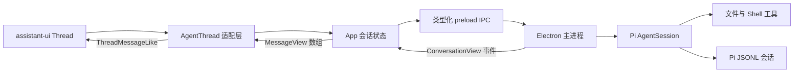

# WorkLens UI 技术方案、当前实现与备选路线

更新日期：2026-09-09
状态：当前方案已在开发分支落地，后续视觉细节仍可迭代。

## 1. 目标与边界

这次改造的目标是把已有的本地 Agent 能力接入一套成熟的对话界面，同时保留 WorkLens 原有的 Electron、Pi 会话、IPC、设置和本地工具逻辑。

本轮主要处理：

- 对话消息、输入框、滚动跟随、停止生成、复制、重试、推理过程和工具调用的展示。
- 新会话欢迎区和快捷任务建议。
- 会话侧边栏中打开、重命名、删除和新建会话的交互细节。
- 设置入口与对话界面的统一布局。
- 浅色界面恢复为简洁白色基线，减少旧样式对组件库的干扰。

本轮没有更换主进程 Agent 实现、Pi JSONL 会话存储、模型认证、IPC 协议或本地工具执行方式。

## 2. 当前采用的技术方案

当前选择是 **assistant-ui 负责对话交互，shadcn registry 提供可维护源码，Base UI 提供底层组件，WorkLens 继续管理业务状态和 Electron/Pi 集成**。

| 层级 | 当前选择 | 职责 |
| --- | --- | --- |
| 桌面运行时 | Electron 42 | 窗口、主进程、预加载桥和系统能力 |
| 前端 | React 19 + TypeScript | 应用状态、设置、会话导航和界面组合 |
| 样式 | Tailwind CSS 4 + CSS variables | assistant-ui 组件样式和 WorkLens 主题变量 |
| 对话 UI | `@assistant-ui/react` 0.15.x | Thread、Composer、消息动作、运行状态和滚动行为 |
| Markdown | `@assistant-ui/react-markdown` 0.14.x | 助手消息的 Markdown 渲染 |
| 基础组件 | shadcn `base-nova` + `@base-ui/react` | Button、Dialog、Tooltip、Textarea 等源码组件 |
| 图标 | Lucide React | 设置、会话操作、发送、工具状态等图标 |
| Agent 与会话 | Pi 0.85.1 | 模型运行、工具调用、JSONL 会话和上下文压缩 |
| 状态桥接 | `useExternalStoreRuntime` | 把现有 `ConversationView` 映射到 assistant-ui runtime |

选择这套组合的原因：

1. assistant-ui 已经覆盖 Agent 对话里最容易反复打磨的部分，包括输入框状态、自动滚动、消息动作、推理块和工具调用。
2. shadcn registry 把组件源码放在仓库内，后续可以直接调整结构和视觉，不会被组件库默认主题锁死。
3. WorkLens 的 Pi 会话和 IPC 已经稳定，不需要为了更换界面重写业务层。
4. 视觉颜色由 CSS variables 控制，可以从当前白色基线继续发展品牌色，无需接受 shadcn 默认的黑灰外观。

## 3. 当前架构



这里没有建立第二份聊天数据库。Pi JSONL 仍然是历史记录的唯一来源，assistant-ui 只负责渲染和交互。

### 3.1 消息映射

`AgentThread.tsx` 使用 `useExternalStoreRuntime<MessageView>()` 接收现有消息，并按角色转换：

| WorkLens 消息 | assistant-ui 表示 |
| --- | --- |
| `user` | 用户文本消息 |
| `assistant.text` | Markdown 文本部分 |
| `assistant.thinking` | reasoning 部分 |
| `tool` | tool-call 部分，包含参数、结果、耗时和错误状态 |
| `summary` | 带“上下文摘要”标题的文本部分 |

会话阶段 `generating`、`tool`、`compacting`、`retrying` 和 `stopping` 会映射为 assistant-ui 的运行状态。取消仍通过原有 IPC，并使用会话 ID 与运行 ID 精确停止对应任务。

### 3.2 发送与草稿

- assistant-ui Composer 提交文本后调用 `App.sendText()`。
- `App` 继续负责重复发送锁、当前会话、模型选择和 IPC 请求。
- 新会话或恢复草稿通过 `draft` 传入适配层，再写入 assistant-ui Composer。
- 切换会话时，`AgentThread` 的 React `key` 会改变，确保 Composer 和 runtime 不串会话。

### 3.3 工具展示

工具消息使用 WorkLens 自定义的 `WorkLensTool`，保留现有测试和产品需要的信息：

- 工具名称和压缩后的参数摘要。
- 执行中、成功、失败、超时和取消状态。
- 命令初始目录、目标路径、超时、退出码、开始时间和耗时。
- 可展开的完整参数和输出。

这样既使用 assistant-ui 的消息生命周期，又不丢失 WorkLens 本地 Agent 特有的工具信息。

## 4. 已完成的界面实现

### 对话区

- 使用 assistant-ui Thread 替换原来自写的消息列表和 Composer。
- 支持用户消息、助手 Markdown、推理内容、工具调用、上下文摘要和运行状态。
- 支持发送、停止、回到底部、复制、重试、编辑和导出等组件能力。
- 空白会话使用原始白色欢迎区，并显示三组任务建议。
- Composer 保持纯输入界面，不在下方重复显示模型名和键盘提示。

### 会话侧边栏

- 保留 Pi 会话的新建、打开、重命名和删除逻辑。
- 修改与删除按钮缩小到 `24px`。
- 操作按钮只在鼠标悬停或键盘聚焦时显示。
- 设置入口中的图标和文字居中。

### 视觉基线

- 浅色主题使用白色内容区和接近白色的侧边栏；深色主题也已重置为中性黑灰 token。
- 移除了上一版暖色背景、径向渐变、欢迎页轨道图形和较重的 Composer 阴影。
- 主文字使用中性深色，绿色只保留给连接和运行状态。
- assistant-ui 组件优先使用自身样式，WorkLens CSS 只补业务相关样式。

## 5. 关键文件

| 文件 | 用途 |
| --- | --- |
| `src/renderer/src/components/worklens/AgentThread.tsx` | WorkLens 数据与 assistant-ui runtime 的适配层 |
| `src/renderer/src/components/assistant-ui/elements/thread.aui.tsx` | 对话 Thread、Composer、消息和动作栏源码 |
| `src/renderer/src/components/assistant-ui/elements/` | Markdown、Reasoning、Tool Group、附件等对话组件 |
| `src/renderer/src/components/ui/` | shadcn/Base UI 基础组件 |
| `src/renderer/src/App.tsx` | 会话导航、设置、发送、取消和 IPC 状态 |
| `src/renderer/src/style.css` | WorkLens 主题变量、旧页面样式和少量对话适配样式 |
| `components.json` | shadcn registry、别名和 `base-nova` 配置 |
| `electron.vite.config.ts` | Renderer 的 `@` 路径别名 |
| `tsconfig.json` | TypeScript 的 `@/*` 路径映射 |

assistant-ui 和 shadcn 生成的组件属于项目源码。需要调整交互或视觉时，可以直接修改这些文件，但升级 registry 组件前要先查看 diff，避免覆盖本地中文文案和 WorkLens 扩展。

## 6. 样式冲突及约束

第一次整合中出现过输入框边框过重、会话按钮过大和设置文字没有正确居中的问题。原因不是中文字体，而是原项目使用了全局元素选择器，例如 `button`、`input` 和 `textarea`，这些规则覆盖了新组件的 Tailwind 样式。

当前处理方式：

- 旧按钮规则只匹配没有 `data-slot` 的按钮。
- 旧输入规则排除 class 名包含 `aui-` 的 assistant-ui 输入组件。
- 对话区删除大部分自定义视觉覆盖，回到 assistant-ui 白色基线。
- WorkLens 自定义 CSS 集中处理侧边栏、模型状态和工具卡片。

后续新增样式时遵守以下约束：

1. 不再为 `button`、`input`、`textarea` 等标签增加无范围的全局视觉规则。
2. 优先调整 `:root` 语义变量，例如 `--bg`、`--surface`、`--text`、`--border` 和 `--accent`。
3. 对话组件的修改优先写在组件的 Tailwind class 中；业务样式使用 `.agent-thread` 或具体业务 class 限定范围。
4. 中文排版使用系统中文字体栈，按钮应设置明确高度并通过 flex 居中，避免依靠 line-height 猜测位置。
5. 深色主题需要与浅色主题分别验收，当前深色 token 仍沿用原项目配置。

## 7. 以后可选的技术方案

### 方案 A：继续深化 assistant-ui + shadcn（推荐）

适合条件：当前对话结构基本符合产品方向，下一步主要是品牌视觉、细节交互和 Agent 状态体验。

可以继续增加：

- 会话搜索、置顶、分组和归档。
- 更清晰的运行步骤、工具时间线与审批节点。
- 附件上传、文件预览和引用来源。
- 模型切换、上下文用量和分支会话。
- 自定义主题 preset，而不是逐个组件覆盖颜色。

优点是改动集中、复用现有适配层、迁移成本最低。需要注意 registry 更新可能与本地修改冲突。

### 方案 B：只使用 shadcn/Base UI，自建完整聊天界面

适合条件：未来的产品交互与主流聊天界面差异很大，例如多面板工作台、画布、任务树或复杂审批流成为核心。

优点：

- 结构和视觉完全可控。
- 更容易把聊天与文件、任务、预览面板做成统一工作区。
- 不依赖 assistant-ui 的 runtime 抽象。

代价：

- 需要自行维护滚动跟随、流式状态、消息动作、编辑重试、无障碍和移动布局。
- 测试面积明显增大。
- 当前 `AgentThread` 适配层将被部分或全部替换。

### 方案 C：Ant Design X + Ant Design

适合条件：设置页、表格、表单、权限、管理后台能力迅速增长，并且希望采用一套覆盖范围更大的企业级设计系统。

优点是企业组件完整、表单和复杂数据界面成熟，Ant Design X 也提供 AI 对话相关组件。代价是整体视觉更强势，包体和主题改造范围更大；要得到轻量、克制的桌面 Agent 风格，需要系统性调整 token 和组件密度。

当前没有选择它，因为 WorkLens 现阶段的核心是桌面对话体验，管理后台型组件并非主要矛盾。

### 方案 D：Headless primitives + 完全自定义视觉

可使用 Base UI、Radix UI 或 React Aria 作为无样式交互基础，消息和状态层继续复用当前 WorkLens DTO。

适合条件：已经有完整品牌设计系统和专门的设计/前端维护能力。它能获得最高的视觉自由度，同时也需要自己承担组件一致性、无障碍、键盘操作和长期维护成本。

## 8. 方案切换判断

不建议只因为颜色或间距不满意就更换技术方案。当前组件源码和 token 都在项目内，这类问题可以直接修正。

出现以下情况时再考虑从方案 A 切换：

| 触发条件 | 建议方向 |
| --- | --- |
| assistant-ui 的消息/runtime 模型持续限制核心需求 | 转为 shadcn/Base UI 自建 Thread |
| 产品演变为大量表格、配置和后台管理页面 | 评估 Ant Design/Ant Design X |
| 已建立完整品牌系统且需要像素级统一 | Headless primitives + 自定义组件 |
| 只是颜色、圆角、字体或密度不合适 | 保留当前方案，修改 token 和组件源码 |

如果需要迁移，应保留 `ConversationView`、`MessageView` 和 IPC 契约，只替换 Renderer 的适配层与组件层。这样不会影响 Pi 会话、工具执行和历史数据。

## 9. 建议的后续迭代顺序

1. **完成视觉基线验收**：空白会话、有历史会话、长回答、工具执行、失败状态和设置页各验收一次浅色主题。
2. **整理 CSS 边界**：逐步把旧页面全局规则改为组件 class，最终取消对标签选择器的依赖。
3. **完善会话体验**：增加搜索、置顶/归档和长标题处理，再考虑时间分组。
4. **完善 Agent 过程展示**：区分思考、计划、工具、结果和等待用户输入。
5. **建立主题 preset**：确定品牌主色、字体、间距、圆角、阴影和深色主题后统一写入 token。
6. **控制包体**：检查旧 Markdown 依赖与未使用的生成组件，确认不需要后再移除。
7. **补充真实界面验收**：在没有其他 Electron 开发实例占用单实例锁时运行完整 E2E。

## 10. 开发与验证

安装依赖后，本地开发只需要：

```sh
npm run dev
```

常规验证：

```sh
npm run typecheck
npm test
npm run build
```

当前改造已通过 TypeScript 检查、生产构建和单元测试（16 项通过，1 项跳过）。完整 Electron E2E 需要先关闭其他 WorkLens/Electron 开发实例，避免单实例锁让测试窗口启动后立即退出。

升级或重新拉取 assistant-ui 组件时使用 shadcn CLI，并在覆盖前检查本地改动：

```sh
npx shadcn@latest add @assistant-ui/thread
git diff -- src/renderer/src/components
```
