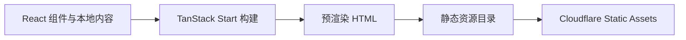

# WorkLens 官网 TanStack 技术栈迁移方案

日期：2026-09-15。状态：首期迁移已实施并通过本地验收；Cloudflare 部署另见 [Cloudflare 部署方案](docs/CLOUDFLARE_DEPLOYMENT_PLAN.md)，尚未启用生产发布。

分支：`docs/website-tanstack-migration-plan`。参考项目：本机 `/Volumes/scofieldFree/my-sass-template/tanstack-sass-template`，只读参考。

## 1. 目标与范围

目标是将 WorkLens Agent 产品官网迁移为预渲染静态网站。首期原样迁入原首页内容、图片、布局和 FAQ，完成 TanStack Start 工程化、静态构建和页面验证。

已经确认的边界：

- 官网文案、能力描述、下载说明和链接仍是占位内容，本次只迁移，不审核产品状态。
- 沿用原首页的暖色纸张背景、深蓝品牌色、编辑式排版和桌面应用截图。
- 所有页面公开访问，不引入登录、注册、用户系统、支付、后台、数据库或认证服务。
- 不建立旧 URL 兼容或重定向清单。
- 文档中心、下载中心、更新日志、多语言和其他公开模块留待后续建设。
- 不适配旧 Worker + R2 发布链路。新部署方向是 Cloudflare Workers Static Assets。

## 2. 技术方案

官网独立使用 Node.js 24 与 npm，核心技术栈为：

- TanStack Start
- TanStack Router
- React 19
- TypeScript
- Tailwind CSS v4
- Vite

页面内容放在本地 TypeScript 数据和 React 组件中。构建阶段生成包含完整正文的 HTML，发布物只包含 HTML、CSS、JavaScript、图片和其他公开静态资源，不部署 Start 的请求时 SSR 服务。



构建启用 `prerender.enabled`、静态路由发现与失败中止。首页包含指向原始 PNG 的链接，因此关闭 `crawlLinks`，防止预渲染器把图片路径当作页面处理。以后新增动态内容路径时，应通过构建期公开内容清单显式列举。

参考：[TanStack 静态预渲染](https://tanstack.com/start/latest/docs/framework/react/guide/static-prerendering)。

## 3. 页面迁移

迁移前首页是 `website/public/index.html` 中的 HTML 和内联 CSS。迁移后由文件路由、分区组件、本地内容数据和独立样式入口组成。

| 首页内容               | 当前实现                  |
| ---------------------- | ------------------------- |
| 品牌与导航             | `SiteHeader`              |
| 主标题、简介和操作入口 | `Hero`                    |
| 桌面应用截图           | `ProductPreview`          |
| 三项产品能力           | `Features`                |
| 开始使用步骤           | `GettingStarted`          |
| 四项 FAQ               | `FAQ`                     |
| 页脚                   | `SiteFooter`              |
| 文案数据               | `src/content/home.ts`     |
| SEO 与分享元数据       | 根布局和首页路由的 `head` |
| 404、robots、sitemap   | `public/` 静态资源        |

FAQ 继续使用原生 `<details>`，导航使用页面锚点。站点 URL、GitHub、Issue、License 和安装说明入口集中在 `src/config/site.ts`。

## 4. 模板取舍

本地 SaaS 模板只用于参考工程结构和兼容依赖，没有复制完整业务能力。

采用：

- Start、Router、React、TypeScript 和 Vite 的基础组织方式。
- Tailwind CSS v4 样式入口。
- 文件路由、根文档壳和类型化路由树。
- 集中的站点配置和基础 SEO 元数据。

未采用：

- TanStack Query 和远程数据缓存。
- Better Auth、登录页、会话查询和认证导航。
- D1、Drizzle、支付、邮件、上传、后台和管理功能。
- 动态分享图 API。
- 模板自带的 Workers SSR、数据库迁移和发布工作流。

## 5. 项目结构

```text
website/
  package.json
  package-lock.json
  tsconfig.json
  vite.config.ts
  wrangler.jsonc
  playwright.config.ts
  src/
    start.tsx
    router.tsx
    routeTree.gen.ts
    routes/
    components/
    config/
    content/
    styles.css
  public/
    assets/
    404.html
    _headers
    robots.txt
    sitemap.xml
  scripts/
    verify-static.mjs
  tests/
    home.spec.ts
  docs/
    CLOUDFLARE_DEPLOYMENT_PLAN.md
    screenshots/
```

官网依赖、类型检查、构建和页面测试与 Electron 桌面应用相互独立。`@/*` 只指向官网 `src/*`，不会导入主进程、preload、Pi 工具或真实用户数据。

## 6. 开发与验证命令

```sh
npm ci --prefix website
npm run dev --prefix website
npm run typecheck --prefix website
npm run build --prefix website
npm run verify:static --prefix website
npm run test:e2e --prefix website
npm run preview:static --prefix website
npm run cloudflare:dry-run --prefix website
```

预渲染静态目录为 `website/.output/public/`。`verify:static` 检查正文、404、robots、sitemap、安全响应头文件和图片字节一致性。Playwright 检查页面交互、图片解码、业务 API 请求、真实 404，以及 390、1024、1280px 三种宽度的横向溢出。

## 7. 已完成验收

| 检查                                          | 结果                                   |
| --------------------------------------------- | -------------------------------------- |
| `npm run typecheck --prefix website`          | 通过                                   |
| `npm run build --prefix website`              | 通过，预渲染 `/`                       |
| `npm run verify:static --prefix website`      | 通过                                   |
| `npm run test:e2e --prefix website`           | 5/5 通过                               |
| `npm run cloudflare:dry-run --prefix website` | 通过，读取 11 个静态文件，0 个 Binding |
| `npm audit --audit-level=moderate`            | 0 项漏洞                               |

Cloudflare 本地模拟已确认首页返回 200、未知路径返回 404、安全响应头生效、图片正常解码，浏览器没有 CSP 或 hydration 错误。桌面端官网完整截图位于 [worklens-homepage.png](docs/screenshots/worklens-homepage.png)。

## 8. 后续扩展方向

后续可按 WorkLens Agent 产品需要增加以下公开静态模块：

- 下载与安装页面。
- 使用文档和快速开始。
- 更新日志和版本详情。
- 连接器及典型工作场景介绍。
- 开源、社区、反馈和贡献入口。

内容规模增长后再引入 Markdown 或内容集合。以上公开模块仍可在构建阶段预渲染，不要求用户系统或数据库。

## 9. 部署状态

`website/wrangler.jsonc` 已切换为 Cloudflare Workers Static Assets 配置，但当前 GitHub Actions 只执行验证，没有 Production Job，也没有调用 `wrangler deploy`。正式部署所需的 Cloudflare API Token、GitHub Environment、首次切换和回滚流程以独立部署方案为准。
