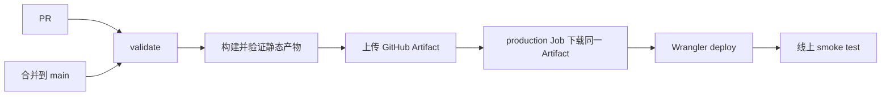

# WorkLens 官网 Cloudflare 部署方案

日期：2026-09-15。状态：部署配置已准备，GitHub Actions 仍为只验证模式，尚未执行新方案的线上部署。

## 1. 目标和边界

WorkLens 官网使用 Cloudflare Workers Static Assets 托管 TanStack Start 的预渲染静态产物。线上只发布 `website/.output/public/`，不发布 `.output/server/`，不运行请求时 SSR、Node.js 服务或业务 API。

新方案不使用旧 R2 内容链路，不需要 `worker.mjs`、R2 Binding、S3 Access Key、`current.json`、Python/Boto3 上传程序或手工维护的 release 目录。以上旧实现文件及其测试已经从仓库移除。

现有 Cloudflare 资源可以直接沿用：

- Cloudflare 账号和 `buildwithais.com` Zone。
- Worker 名称 `worklens-site`。
- 自定义域名 `worklens.buildwithais.com`。

因此不需要重新创建 Worker、修改 DNS 或重新绑定域名。新配置部署到同名 Worker 后，新的 Static Assets 版本会成为该域名的源站。

## 2. 仓库配置

### Wrangler

`website/wrangler.jsonc` 是部署配置的唯一代码来源，关键内容如下：

```jsonc
{
  "name": "worklens-site",
  "compatibility_date": "2026-09-12",
  "workers_dev": false,
  "preview_urls": true,
  "assets": {
    "directory": "./.output/public",
    "not_found_handling": "404-page",
    "html_handling": "auto-trailing-slash",
  },
  "routes": [
    {
      "pattern": "worklens.buildwithais.com",
      "custom_domain": true,
    },
  ],
}
```

- `assets.directory` 相对于 Wrangler 配置文件，指向已验证的静态产物。
- `404-page` 使用最近的 `404.html` 并返回 HTTP 404，不把未知路径改写成首页。
- 配置不含 `main`，因此没有 Worker 请求处理代码。
- 配置不含任何 R2、KV、D1 或其他存储绑定。

参考：[Workers Static Assets](https://developers.cloudflare.com/workers/static-assets/)、[SSG 与自定义 404](https://developers.cloudflare.com/workers/static-assets/routing/static-site-generation/)、[Wrangler 配置](https://developers.cloudflare.com/workers/wrangler/configuration/)。

### 依赖和命令

Wrangler 作为 `website` 的固定开发依赖纳入锁文件，避免 CI 临时下载不确定版本。

```sh
npm run cloudflare:dry-run --prefix website
npm run cloudflare:deploy --prefix website
```

第一条只校验并生成待上传内容，不修改 Cloudflare；第二条会创建并立即启用新的生产版本。

### 响应头

`website/public/_headers` 会随构建复制到静态产物，由 Workers Static Assets 解析并应用。它负责 CSP、点击劫持防护、MIME 嗅探防护、Referrer Policy 和浏览器能力限制。

TanStack Start 当前输出包含用于滚动恢复和 hydration 的内联脚本，因此 CSP 的 `script-src` 暂时需要 `'unsafe-inline'`。后续若框架支持稳定 nonce 或构建期脚本哈希，再收紧该项。

首期保留 Cloudflare 默认缓存策略和 ETag。当前 `worklens.png`、`icon.png` 没有内容哈希，不给整个 `/assets/*` 设置 `immutable`，避免图片更新后浏览器长期使用旧文件。

参考：[Static Assets Headers](https://developers.cloudflare.com/workers/static-assets/headers/)。

## 3. Cloudflare 和 GitHub 所需配置

### Cloudflare API Token

原 GitHub CI 使用 R2 S3 Access Key，只能上传 R2 对象。Workers Static Assets 每次发布都会创建新的 Worker 版本，因此 GitHub Actions 需要一个 Cloudflare API Token。

建议使用 Cloudflare 的 `Edit Cloudflare Workers` Token 模板，并把资源范围限制到当前账号与 `buildwithais.com` Zone。需要的核心权限：

- Account / Account Settings / Read。
- Account / Workers Scripts / Edit。
- Zone / Workers Routes / Edit。

不授予 Workers R2 Storage、KV、D1 或其他未使用资源的编辑权限。

参考：[Cloudflare GitHub Actions 认证](https://developers.cloudflare.com/workers/ci-cd/external-cicd/github-actions/)。

### GitHub Environment

在仓库创建或继续使用 `website-production` Environment：

| 名称                    | 类型                 | 用途                     |
| ----------------------- | -------------------- | ------------------------ |
| `CLOUDFLARE_API_TOKEN`  | Environment Secret   | Wrangler 发布身份        |
| `CLOUDFLARE_ACCOUNT_ID` | Environment Variable | 指定 Cloudflare 目标账号 |

当前仓库中的 `WORKLENS_R2_ACCESS_KEY_ID` 和 `WORKLENS_R2_SECRET_ACCESS_KEY` 不属于新方案。部署切换并确认稳定后，可以从 GitHub 删除。

部署凭据只注入 production Job；PR 的构建与浏览器测试不读取这些值。GitHub Environment 可以按需要配置 `main` 分支限制或 Required Reviewer。参考：[GitHub deployment environments](https://docs.github.com/en/actions/concepts/workflows-and-actions/deployment-environments)。

## 4. GitHub Actions 发布流程

当前 `.github/workflows/website.yml` 只执行验证。正式启用发布时，在同一工作流中加入以下阶段：



### Validate Job

继续执行：

1. `npm ci --prefix website`
2. `npm run typecheck --prefix website`
3. `npm run build --prefix website`
4. `npm run verify:static --prefix website`
5. `npm run test:e2e --prefix website`
6. 上传 `website/.output/public/` 为 GitHub Artifact

### Production Job

仅在 `push` 到 `main` 时运行，配置 `needs: validate` 和 `environment: website-production`。该 Job 下载 Validate Job 生成的 Artifact，再执行 Wrangler deploy，保证发布的字节就是通过测试的字节。

生产 Job 不重新构建，不安装桌面应用依赖，也不读取 R2 凭据。部署并发组设置为不可互相取消，避免两个生产版本交叉发布。

### 线上验证

部署后至少验证：

- `/` 返回 200，HTML 包含 WorkLens 标题和预渲染正文。
- `/assets/worklens.png` 返回 200 且可以解码。
- 不存在的路径返回 404 和自定义 404 正文。
- CSP、`X-Content-Type-Options`、`X-Frame-Options`、`Referrer-Policy` 与 `Permissions-Policy` 存在。
- 页面在浏览器中没有资源错误、hydration 错误或业务 API 请求。

线上验证失败时，Job 标记失败，不自动删除旧版本或修改其他 Cloudflare 资源。

## 5. 首次切换步骤

1. 合并静态站、Wrangler 配置和只验证 CI；此时不会上线。
2. 在 Cloudflare 创建最小权限 API Token。
3. 在 GitHub `website-production` Environment 添加 Token 和 Account ID。
4. 加入 Production Job，先通过 `workflow_dispatch` 执行首次发布。
5. 检查正式域名、资源、404、安全响应头和浏览器控制台。
6. 验证稳定后，允许以后在合并 `main` 后自动发布。
7. 删除 GitHub 中不再使用的旧 R2 Secret；R2 Bucket 的删除作为独立基础设施清理操作处理。

第一次 `wrangler deploy` 会直接更新同名 `worklens-site` Worker 的生产版本，因此应在 Validate Job 全部通过后进行。

## 6. 回滚

Workers 的每次发布都会创建版本。需要回滚时，在 Cloudflare Dashboard 的 Worker Deployments 中选择上一版本，或执行：

```sh
cd website
npx wrangler rollback --message "Rollback WorkLens website"
```

回滚会立即把选中的 Worker 版本恢复为该域名的活动版本。新方案的回滚不依赖 R2、`current.json` 或重新上传旧文件。参考：[Workers Rollbacks](https://developers.cloudflare.com/workers/versions-and-deployments/rollbacks/)。

## 7. 上线验收标准

- GitHub PR 没有生产凭据，不能发布正式域名。
- 合并 `main` 只有在类型检查、构建、静态校验和浏览器测试全部通过后才能部署。
- Cloudflare 上的活动版本只包含 `.output/public` 和 Static Assets 配置。
- 正式域名保持 HTTPS 正常，首页、资源、404 和安全响应头通过线上验证。
- 运行时没有 R2、数据库、认证服务、Node.js SSR 或自定义 Worker 请求处理代码。
- Cloudflare 可以按版本回滚，GitHub Actions 记录每次生产发布。

## 8. 当前本地验证记录

2026-09-15 已完成以下不产生线上变更的检查：

| 检查                                          | 结果                                                       |
| --------------------------------------------- | ---------------------------------------------------------- |
| `npm run build --prefix website`              | 通过，预渲染首页和公开资源                                 |
| `npm run verify:static --prefix website`      | 通过，包含 `_headers`、正文、404 和图片字节检查            |
| `npm run cloudflare:dry-run --prefix website` | 通过，Wrangler 读取 11 个静态文件并报告 0 个 Binding       |
| `wrangler dev` Cloudflare 本地模拟            | 首页 200、未知路径 404、安全响应头生效                     |
| Chrome 访问本地模拟                           | 图片解码正常、390px 无溢出、控制台无 CSP 或 hydration 错误 |

以上检查没有调用 `wrangler deploy`，没有修改 Cloudflare 活动版本或正式域名。
